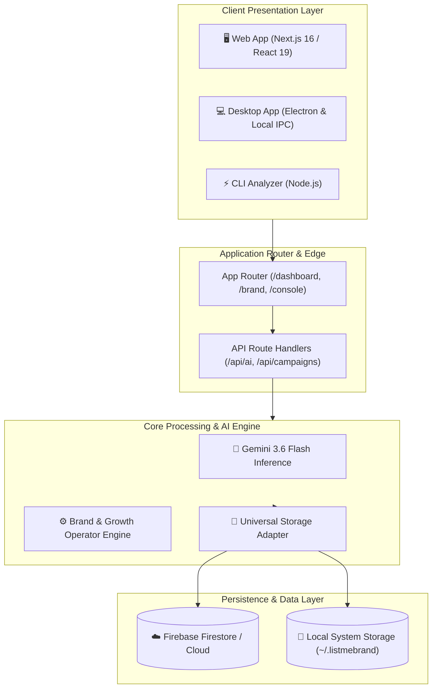
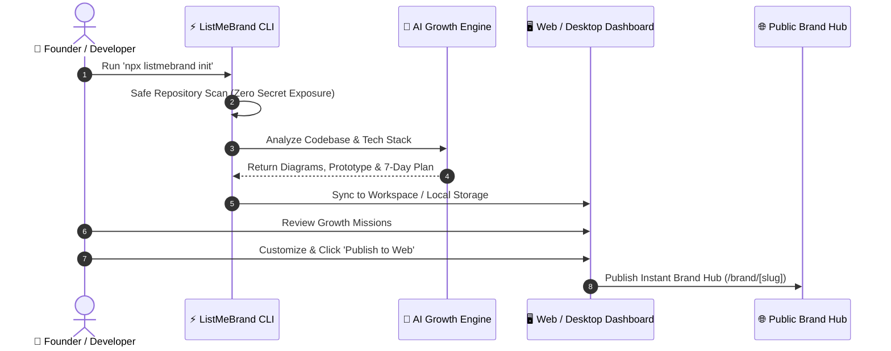
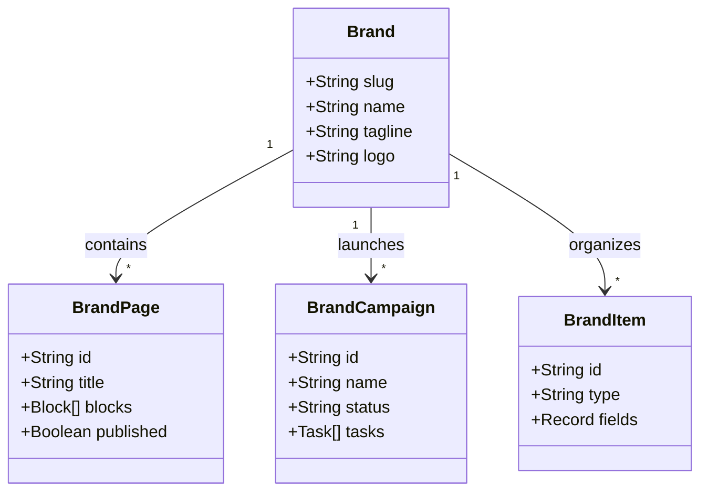

# System Architecture & Diagrams: GIBRAN & CO.

> Auto-generated Mermaid diagrams modeling system flow, user journeys, and data schemas.

## 1. System & Cloud Architecture
Architecture overview for GIBRAN & CO., connecting client interfaces to the application engine.

---

## 2. End-to-End User Journey
User interaction flow from codebase scanning to publishing living documentation.

---

## 3. Domain Data Models & Relationships
Core entities and relationships across the workspace.

